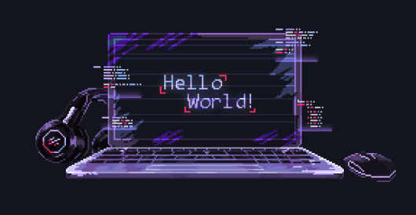

<h1 align="center">
  
</h1>

  

## Sobre mim

Cursando o terceiro semestre de Redes de Computadores no SENAI com foco em Backend e desenvolvimento WEB, além disso, possuo experiência prática com nuvem AWS e Azure.

    

**Frase de impacto**

---

## Tech Stack

  

  
  
  
  
  
  
  
  

## Certificações

 | Certificação | Nome |
 | --- | --- | 
 |  | Cisco NetAcademy Introduction to Networks |
 |  | AWS Academy Cloud Foundations |

## Conquistas 🏆
- Voluntario no grupo de jovens EJC
- Voluntario na equipe da chácara das flores

## Projetos
- Casa Inteligente voltada aos PCDs
- Monitoramento On-premisses com o uso de Zabbix & Grafana (AlertFlow)
- Infraestrutura em nuvem utilizando AWS e Azure (TechWave)
- Cabeamento estruturado baseado em empresas reais
- Infraestrutura de Redes no Packet Tracer

  

## Conecte-se comigo! 🖥

  

<h4 align="center">
  Obrigado por visitar!
   
   
  

   
  

</h4>
